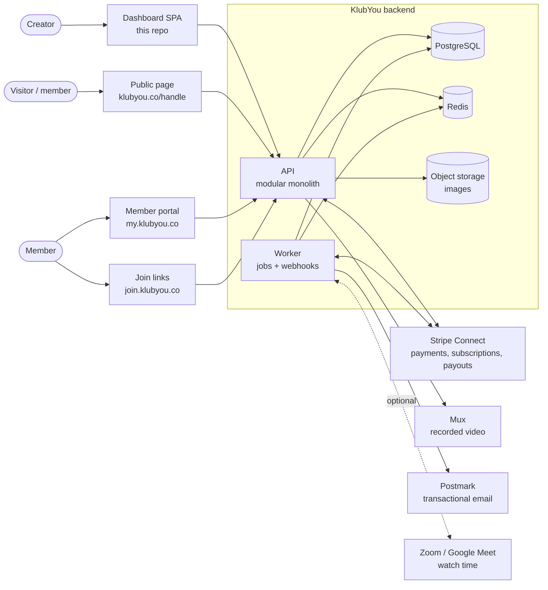

# KlubYou backend — design

**Status: proposal (2026-09-16).** Nothing here is built yet. This is the design
the backend should be built to. It is derived from the product as it exists in
this repo — [decisions.md](../decisions.md), [domain.md](../domain.md) and the
rules in `src/lib/` — and every choice below points back to the rule it serves.
Where the design needs a product decision nobody has made yet, it says so
(see [delivery.md → Open questions](delivery.md#open-questions)).

| Read | For |
| ---- | --- |
| this page | What the backend is for, its parts, the stack, and the principles it keeps |
| [data-model.md](data-model.md) | The 18 tables, what's stored and — as important — what isn't and why |
| [api.md](api.md) | Conventions, and every endpoint mapped to the dashboard action it replaces |
| [flows.md](flows.md) | Sign-up, publishing, buying, renewals, payouts, the join link, settings changes, jobs |
| [delivery.md](delivery.md) | Security, privacy, testing, operations, the build order, and open questions |

**Keep this current.** When the backend is built, these pages become the
architecture docs for it: update them in the same change as the code, as
CLAUDE.md asks for the frontend.

---

## What the backend has to do

Today the dashboard is a prototype: every rule works, but the data lives in
React state and resets on reload. The backend makes it real.

1. **Persist the studio** — programmes, everyday lessons, membership, My page,
   settings — for many creators at once, each seeing only their own.
2. **Take money.** Sell plans and programme offers, renew subscriptions, take
   KlubYou's 10% fee, pay creators out every Friday, handle failed payments,
   vouchers and gifted days. None of this is real in the prototype.
3. **Serve the public page** (`klubyou.co/<handle>`) — the *published* snapshot,
   published content only.
4. **Run the join links** (`join.klubyou.co/<handle>/…`) — check the session is
   open and the member has access, record attendance, redirect to Zoom / Meet /
   YouTube. The decision log says this lives on its own domain; the backend is
   what answers it.
5. **Give members somewhere to be** — sign in, see what they bought, watch
   recorded programmes, manage a subscription. The prototype has no member side
   at all; the backend needs one even if its UI comes later.
6. **Send what the platform must send** — sign-up codes, receipts, failed-payment
   notices, "your class moved". (The dashboard's own "Email" buttons deliberately
   open the creator's mail app; that stays — see open questions.)

## System context

## The stack (proposed)

| Concern | Choice | Why |
| ------- | ------ | --- |
| Language | **TypeScript on Node 22** | The business rules already exist as JavaScript in `src/lib/`. One language lets the backend run *the same functions* the dashboard runs, instead of a second copy that drifts — the failure `domain.md` exists to prevent. |
| Shape | **Modular monolith** (one deployable, one database, clear modules) + a **worker** process | One team, one product, strong consistency needs (a payment and the access it grants change together). Microservices would add network failure modes for no gain at this size. |
| HTTP | **Fastify** | Fast, schema-first (JSON Schema → validation and OpenAPI from the same definitions), no framework magic. |
| Database | **PostgreSQL 16** | Relational data with real constraints (one best seller per studio, one attendance per person per session), row-level security for tenancy, `timestamptz` and `AT TIME ZONE` for the time-zone rules. |
| Queries | **Drizzle ORM** + SQL migrations | Typed, close to SQL, migrations are plain files that can be reviewed. |
| Jobs | **BullMQ on Redis** | Renewal reminders, webhook processing, class reminders, retries with back-off. Redis also holds rate limits, sign-up codes and idempotency keys, so none of them needs a table. |
| Payments | **Stripe Connect (Express accounts)** | Creators get paid directly; `application_fee_percent` takes the 10%; Stripe runs subscriptions, retries, card storage (PCI), and **weekly payouts anchored on Friday** — matching `PAYOUT_WEEKDAY`. |
| Recorded video | **Mux** | Signed playback so only buyers can watch, and per-viewer watch data for "videos watched". Today videos are pasted YouTube links, which can't be restricted to buyers. |
| Images | **S3-compatible storage (Cloudflare R2)** + CDN | Header image and avatar are data URLs in the prototype because there's no server. 5 MB / JPG-PNG-WebP-GIF limits stay (`imageFileProblem`). |
| Email | **Postmark** | Transactional delivery with bounce handling. |
| Time zones | **Luxon** (Temporal when stable) | Replaces the prototype's `locale.js` `partsOf` / `zonedDate` with the same semantics. |
| Auth | Own sessions (httpOnly cookie) + **Google OAuth** + email OTP | The onboarding already has email + password + 6-digit code, and "Continue with Google". |

## Modules

Each module owns its tables and exposes functions to the others; nothing reaches
into another module's tables. They mirror the dashboard's pages and `src/lib/` files.

| Module | Owns | Rules come from |
| ------ | ---- | --------------- |
| `identity` | users, sessions, OTP codes, OAuth links | onboarding |
| `studios` | studios and their settings | `lib/settings.js`, `lib/locale.js` |
| `page` | the page draft and **every published version** (restorable), uploads | `lib/page.js` |
| `programmes` | programmes (with their sections list) | `lib/programme.js` |
| `classes` | **one table** for everyday lessons, one-offs, programme classes and videos (`kind`) | `lib/everyday.js`, `lib/programme.js` |
| `schedule` | *nothing* — derives occurrences | `lib/schedule.js` |
| `membership` | memberships (plans and offers), membership items (bundles and benefits) | `lib/membership.js` |
| `members` | members, purchases, vouchers | `lib/members.js` |
| `billing` | payments, checkout, Stripe webhooks (payouts read from Stripe) | `lib/payments.js`, `lib/stats.js` |
| `attendance` | attendance, join links | `lib/attendance.js`, `lib/sessions.js` |
| `learning` | video progress | `lib/members.js` (`progressOf`) |
| `insights` | *nothing* — overview, attention list, activity | `lib/overview.js` |
| `notifications` | *nothing* — templates in code, delivery log in Postmark | — |

## Principles carried over from the frontend

These are the rules the prototype learned the hard way. The backend keeps every one.

1. **Derive, don't store** (`domain.md` → The one principle). No column holds a
   total, a status that follows from a date, a label, a discount, "next class",
   "on now", a plan's contents or the schedule. Store what a person decided and
   what happened. *What happened* is new on the backend: a payment's fee at the
   time it was taken, an attendance record, a Stripe event — those are facts,
   not derivations, and are stored.
2. **One set of rules, run in both places.** `src/lib/` moves into a shared
   package (`packages/rules`) that the dashboard and the API both import. The
   API enforces the rule (can this be published? can this member attend?); the
   dashboard uses the same function to explain it before the request is made.
   See [delivery.md → Phase 0](delivery.md#phase-0--share-the-rules).
3. **Drafts never reach members.** Enforced in queries, not just in UI: every
   public and member-facing read filters `status = 'published'`, and tests prove
   a draft can't be fetched through any public route.
4. **Membership questions go through the helpers.** An "everything" plan has an
   empty bundle list; reading the join table directly is the bug that shipped
   three times. The API exposes `plan_content(plan)` and the access check calls
   `planHasProgramme` / `planHasLesson`, never the raw rows.
5. **Times are the studio's; instants are UTC.** Store `timestamptz`; store
   wall-clock things (an everyday lesson's `07:00`, a one-off's date, a run
   window's start day) as local values interpreted in `studios.timezone`.
   **The prototype's module-level `applyStudioLocale` must not reach the
   server** — a global zone in a process serving many studios would give one
   studio another's clock. Every rule takes the zone explicitly.
6. **Money is the studio's currency, in minor units.** Integers (`4000` = £40),
   never floats or `"£40"` strings.
7. **Copy says what will happen.** API error messages are written for the
   creator in the same voice as the UI ("Add an intro video first — it's what
   buyers watch"), because the dashboard shows them as they are.
8. **One model per idea.** Everything a member attends or watches is a
   `classes` row; everything a member buys is a `memberships` row. Differences
   between kinds are enforced by check constraints, not by separate tables; the
   UI keeps its own words for each. (Decision 2026-09-16.)
9. **Actions do the cascading.** Deleting a bundle removes it from plans in the
   same transaction; changing a handle keeps share links right. Never leave it
   to a caller.
