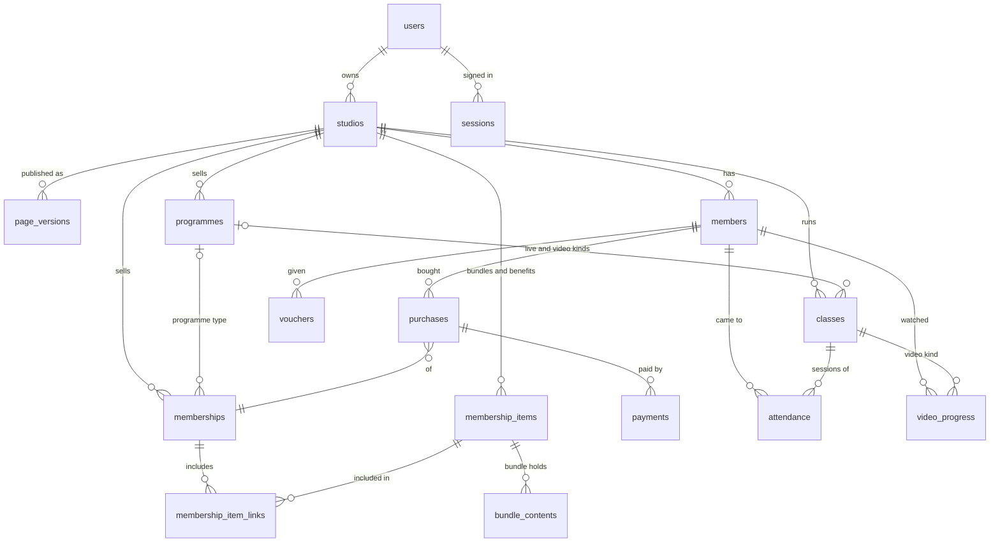

# Data model

PostgreSQL. **18 tables.** Every business table has `studio_id` and is protected
by row-level security (see [delivery.md → Tenancy](delivery.md#tenancy-and-row-level-security)).

The rule for what gets a table or a column: **store what a person decided, and
what happened that nothing else remembers.** Anything that can be worked out
(`domain.md` → derive, don't store), anything Stripe or Mux already keeps, and
anything that only exists for "later" is left out — see
[What was left out](#what-was-left-out-and-where-it-went) at the end.

Conventions:

- **IDs**: UUIDv7, shown in the API with a type prefix (`prg_…`, `cls_…`, `msp_…`, `mem_…`).
- **Times**: `timestamptz` for instants; `time` / `date` for wall-clock values in
  the studio's zone, named `local_time` / `local_date`.
- **Money**: `bigint` minor units (`4000` = £40), in the studio's currency — except
  payments, which record the currency they were charged in.
- **One model per idea.** Everything a member attends or watches is a `classes`
  row (`kind`); everything a member buys is a `memberships` row (`type`); bundles
  and extra benefits are `membership_items` rows (`kind`). The UI keeps its words.
- `created_at`, `updated_at` on every table. `updated_at` doubles as the version
  for "this changed in another tab" checks ([api.md](api.md#concurrency)) — no
  separate version counters.



| Area | Tables |
| ---- | ------ |
| Identity | `users`, `sessions` |
| Studio and page | `studios`, `page_versions` |
| Content | `programmes`, `classes` |
| Selling | `memberships`, `membership_items`, `membership_item_links`, `bundle_contents` |
| People and money | `members`, `purchases`, `vouchers`, `payments` |
| Activity | `attendance`, `video_progress` |
| Platform | `webhook_events`, `audit_log` |

---

## Identity

### `users`
A person who can sign in — creator, member, or both.

| Column | Type | Notes |
| ------ | ---- | ----- |
| `email` | citext unique | |
| `name` | text | |
| `password_hash` | text null | argon2id. Null for Google-only |
| `google_sub` | text unique null | |
| `email_verified_at` | timestamptz null | Set by the 6-digit code or Google |

### `sessions`
(user_id, token_hash, expires_at). Revocable sign-ins. Sign-up codes and
magic-link tokens live in **Redis** with a 10-minute expiry — they're gone in
minutes and never need a query, so they don't need a table.

## Studio and page

### `studios`
| Column | Type | Notes |
| ------ | ---- | ----- |
| `owner_id` | uuid | The user who owns it. One owner; staff would be a table later, when there are staff |
| `handle` | citext unique | `klubyou.co/<handle>`. Check constraint mirrors `handleProblem`; reserved words ("admin", "studio"…) are a list in code, like `takenHandles` today |
| `name` | text | 1–60 (`nameProblem`) |
| `currency` | char(3) | One of `CURRENCIES` |
| `timezone` | text | IANA zone |
| `stripe_account_id` | text null | Whether it can take payments is asked of Stripe (cached), not copied here |
| `page_draft` | jsonb | **My page as it's being edited** — see below |

### `page_versions` — every published version of My page, kept
The creator asked for every version of the page to be saved so it can be
reverted to. The page is one document (the `pageSnapshot` shape: tagline, about,
intro video, cover and avatar image keys, links ≤ 8, theme, section order,
hidden sections, hidden programmes), so a version is one row holding it.

| Column | Type | Notes |
| ------ | ---- | ----- |
| `id` | uuid | |
| `studio_id` | uuid | |
| `number` | int | 1, 2, 3… per studio. Unique `(studio_id, number)` |
| `content` | jsonb | The whole page as published |
| `published_at` | timestamptz | |
| `published_by` | uuid | The user |
| `restored_from` | int null | The version number it was restored from, if it was |

How it works:

- **Editing** changes `studios.page_draft` only. Visitors never see the draft.
- **Publishing** appends a new version with the draft's content — only when it
  differs from the latest version (`pageChanged`), so pressing Publish twice
  doesn't make two identical versions.
- **What visitors see is the latest version.** There's no "published" copy or
  pointer to keep in step: `order by number desc limit 1`.
- **Restoring** version 4 copies its content into the draft, so the creator can
  look at it in the preview first; publishing then adds it as a new version (say
  9) with `restored_from = 4`. The option "restore and publish" does both at once.
  **History is never rewritten** — versions 5–8 stay, and restoring can itself be
  undone by restoring 8.
- Versions are **append-only**: the app's database role can insert and read
  them, never update or delete. They're small (a few KB each), so all are kept.
- The image cleanup job never deletes an image any version still refers to, so
  an old version restores with its pictures.
- **Not in a version:** the studio name (it's a setting on `studios`, changed
  immediately — decision 2026-09-16), and plans and programmes (published on
  their own pages). Restoring an old page shows today's plans and programmes.

## Content

### `programmes`
| Column | Type | Notes |
| ------ | ---- | ----- |
| `type` | enum `live|recorded` | |
| `status` | enum `draft|published` | Publishing enforced by `readiness()` |
| `name`, `description` | text | |
| `intro_video_url` | text null | Required to publish |
| `cover` | text | The card's colour today |
| `certificate` | bool | |
| `studio_only` | bool null | `null` = undecided, `true` = subscribers only ("How it's sold must be decided") |
| `sections` | jsonb | Recorded only: `[{ id, title }]` in order. Videos point at a section id |

- **No slug and no stored share link.** The share link uses the id
  (`klubyou.co/<handle>/p/<id>`), like members' class links already do — a rename
  never breaks it and there's nothing to rewrite when the handle changes.
- **No dates** — a live programme runs from its first class to its last (`runWindow`).
- **Sections are a list on the programme**, not a table: they have a title and
  an order and nothing else points at them except their videos. Renaming,
  reordering and deleting (with its videos, in the same transaction) are one
  update of the programme row plus its classes.
- A programme's prices are `memberships` of type `programme`; its content is `classes`.

### `classes` — everything a member attends or watches
Everyday lessons, one-offs, live programme classes and recorded videos.

| Column | Type | Kinds | Notes |
| ------ | ---- | ----- | ----- |
| `kind` | enum `lesson|oneoff|live|video` | all | |
| `programme_id` | uuid null | live, video | |
| `section_id` | uuid null | video | An id from `programmes.sections` |
| `position` | smallint null | video | Order within the section |
| `series_id` | uuid null | live | Classes created as one repeat |
| `title` | text | all | |
| `starts_at` | timestamptz null | live | An instant |
| `local_time` | time null | lesson, oneoff | "07:00" in the studio's zone |
| `weekdays` | smallint[] null | lesson | 0 = Sunday … 6 |
| `local_date` | date null | oneoff | |
| `venue_url` | text null | lesson, oneoff, live | The hosting link. Never sent to members |
| `video` | text null | video | A Mux playback id, or a pasted link |
| `duration_seconds` | int null | video | From Mux |
| `inactive_at` | timestamptz null | all | Paused (lesson) · cancelled (live) · hidden (video) |

One check constraint per kind keeps a row from being half one thing and half another:

```sql
check (
  (kind = 'lesson' and programme_id is null and cardinality(weekdays) > 0 and local_time is not null
     and local_date is null and starts_at is null)
  or (kind = 'oneoff' and programme_id is null and local_date is not null and local_time is not null
     and coalesce(cardinality(weekdays), 0) = 0 and starts_at is null)
  or (kind = 'live' and programme_id is not null and starts_at is not null
     and local_time is null and local_date is null)
  or (kind = 'video' and programme_id is not null and section_id is not null and position is not null
     and starts_at is null and venue_url is null)
)
```

**Not stored:** occurrences (the schedule is derived), platform (read from
`venue_url`), when a programme runs (`runWindow`).

## Selling

### `memberships` — everything a member buys
Studio plans (`type = studio`) and programme offers (`type = programme`).

| Column | Type | Types | Notes |
| ------ | ---- | ----- | ----- |
| `type` | enum `studio|programme` | both | |
| `programme_id` | uuid null | programme | |
| `status` | enum `draft|published` null | studio | An offer is on sale exactly when its programme is published |
| `name` | text | both | Plan name, or offer label ("Full programme") |
| `description` | text null | studio | |
| `interval_months` | smallint null | both | Null = pay once (lifetime); a number = renews every N months. Required for studio |
| `amount_minor` | bigint | both | |
| `list_amount_minor` | bigint null | studio | "Full price", `>= amount_minor` |
| `best_seller` | bool | studio | Partial unique index: one per studio |
| `includes_everything` | bool | studio | The prototype's `scope: "all"` — every published bundle and benefit, now and later |
| `stripe_price_id` | text null | both | |
| `archived_at` | timestamptz null | both | Bought once, so archived rather than deleted |

```sql
check (
  (type = 'studio' and programme_id is null and status is not null and interval_months is not null)
  or (type = 'programme' and programme_id is not null and status is null
     and list_amount_minor is null and not best_seller and not includes_everything)
)
```

Derived, not stored: offer kind (`interval_months` null → pay once), lifetime,
renews, on sale, every label and saving.

### `membership_items` — bundles and extra benefits
The comparison table's rows. A bundle and a benefit have the same shape — a
name, a line of detail, draft/published, a place in one shared order (decision
"Row order is set in the table, and kinds mix") — so they're one table, and the
order is a column instead of a table of its own.

| Column | Type | Notes |
| ------ | ---- | ----- |
| `kind` | enum `bundle|benefit` | |
| `status` | enum `draft|published` | |
| `name` | text | |
| `detail` | text null | Bundle description / benefit detail |
| `position` | int | Unique `(studio_id, position)`, deferrable; renumbered 1…n by `moveMembershipRow` |

### `membership_item_links`
(membership_id, item_id). Which bundles and benefits a studio plan includes —
one join table for both kinds. **Kept when a plan switches to
`includes_everything`**, so switching back restores the picks. Read only through
`bundlesOf` / `planContent`.

### `bundle_contents`
(item_id, programme_id null, class_id null — exactly one). What a bundle holds:
programmes, and everyday lessons or one-offs.

## People and money

### `members`
A person in one studio: (user_id null, name, email, joined_at). Unique
`(studio_id, email)`. No purchases = a **lead**, derived.

Plus `link_token_hash` — the personal token in a member's class links (`?m=`).
One per member; "reset their links" replaces it. It doesn't need a table.

### `purchases`
What a member bought — the prototype's `planId` / `offerId` / `renewsAt` / `autoRenew`.

| Column | Type | Notes |
| ------ | ---- | ----- |
| `member_id` | uuid | |
| `membership_id` | uuid | A plan or an offer |
| `started_at` | timestamptz | |
| `renews_at` | timestamptz null | Null for lifetime |
| `auto_renew` | bool | False once renewal is stopped |
| `ended_at` | timestamptz null | When access actually ended |
| `stripe_subscription_id` | text null | |

Status (*Active, Renews soon, Ending, Payment due, Inactive*) is derived by `stateOf`.

### `vouchers`
(member_id, code, percent, stripe_promotion_code_id). Unique `(studio_id, code)`.
Whether it's been used is Stripe's to know.

### `payments`
| Column | Type | Notes |
| ------ | ---- | ----- |
| `purchase_id` | uuid | Which member and membership follow from it |
| `amount_minor` | bigint | |
| `currency` | char(3) | As charged |
| `fee_minor` | bigint | KlubYou's fee as taken — the rate can change |
| `status` | enum `pending|paid|refunded` | `pending` = hasn't gone through (*Payment due*) |
| `paid_at` | timestamptz null | |
| `method` | enum `card|manual` | `manual` = marked paid by the creator |
| `stripe_id` | text null unique | The invoice or payment intent |

**No payouts table.** Payouts are Stripe's record; the Payments page reads them
from Stripe when it needs the list. "Next payout" stays computed (`nextPayoutDay`).

## Activity

### `attendance`
One record per person per session.

| Column | Type | Notes |
| ------ | ---- | ----- |
| `class_id` | uuid | A `lesson`, `oneoff` or `live` class. **No foreign key on purpose:** deleting a class keeps who came (decision "the people still came") |
| `session_date` | date | The studio-local day of the session. Kept as recorded, so a later zone change doesn't move history |
| `member_id` | uuid | |
| `at` | timestamptz | First time in |
| `via` | enum `link|marked` | |

Unique `(class_id, session_date, member_id)`. The dashboard's session key
(`class:…` / `lesson:…:date`) is built from these two columns; it isn't stored.
Who marked someone is in `audit_log`.

### `video_progress`
(member_id, class_id, completed_at). One row per video finished; "videos
watched" counts them (`progressOf`). Where someone paused is kept by the player.

## Platform

### `webhook_events`
(id = the provider's event id, provider `stripe|mux`, type, payload, processed_at,
error). Stored before processing, so a replayed event is a no-op.

### `audit_log`
(studio_id, actor_id, action, subject, before jsonb, after jsonb, at). One place
for who did what: settings changes, publishing, marking paid, marking attendance,
gifting days, refunds, link resets. It's what replaces the `marked_by`,
`gifted_days` and history columns the design used to scatter across tables.

---

## What is deliberately not stored

| Derived | From | Rule |
| ------- | ---- | ---- |
| Member status, renewal, lifetime, lead | purchases, payments, now | `stateOf`, `renewalOf`, `isLifetime` |
| Classes attended, videos watched | attendance, video_progress | `progressOf` |
| Plan contents, savings, % off, per month, hollow | memberships, items, links | `planContent`, `discountPercent`, `perMonth`, `planIsHollow` |
| When a programme runs | its classes | `runWindow` |
| Schedule, next class, on now, clashes | classes, zone, now | `occurrencesBetween`, `weekOf` |
| Readiness | programme and content | `readiness` |
| Session reports, quiet members | attendance, purchases | `sessionReport`, `quietMembers` |
| Overview, attention list, activity | everything above | `lib/overview.js` |
| Share and members' links | handle, ids | `joinLinkOf` |
| The published page | the latest `page_versions` row | — |

## What was left out, and where it went

The first draft of this design had 34 tables. These went, because something
else already does their job:

| Removed | Instead |
| ------- | ------- |
| `email_codes`, `idempotency_keys` | Redis, with expiry |
| `studio_staff` | `studios.owner_id` (add staff when there are staff) |
| `reserved_handles` | A list in code |
| `handle_history` | Nothing until old-handle redirects are decided (open question 2) |
| `page_documents` (draft + published) | `studios.page_draft` + `page_versions` — the latest version *is* the published page |
| `assets` | Image keys stored in the page; storage holds the files |
| `sections` | A list on `programmes` |
| `bundles`, `benefits`, `comparison_rows` | `membership_items` with a `kind` and a `position` |
| `membership_bundles`, `membership_benefits` | `membership_item_links` |
| `bundle_programmes`, `bundle_classes` | `bundle_contents` |
| `access_grants` | Renamed `purchases`, with `gifted_days` dropped (audit log) |
| `payouts` | Read from Stripe |
| `stripe_events` | `webhook_events`, for every provider |
| `join_events` | Structured logs (every join outcome is logged, searchable for support) |
| `member_link_tokens` | `members.link_token_hash` |
| `watch_sessions` | Later, with a Zoom integration |
| `email_messages` | Postmark's own message log |
| Columns | `slug`, `published_at`, `payouts_enabled`, `source`, `title_snapshot`, `due_at`, `period_start/end`, `redeemed_at`, `session_key`, `marked_by`, `position_seconds`, `version`, split video columns, split Stripe id columns |

## Mapping from the prototype

| `mockData.js` | Becomes |
| ------------- | ------- |
| `initialStudio` | `studios` (settings + `page_draft`) + one `page_versions` row |
| `initialProgrammes` | `programmes` (`sections` → the `sections` list; `shareUrl` derived) |
| `…pricing.offers` | `memberships`, `type = programme` (`price` → `amount_minor`; `kind: oneoff` → `interval_months` null) |
| `…classes[]`, `…sections[].videos[]` | `classes`, kind `live` / `video` |
| `initialEverydayLessons` | `classes`, kind `lesson` / `oneoff` |
| `initialStudioPlans` | `memberships`, `type = studio` (`scope: "all"` → `includes_everything`) |
| `initialBundles`, `initialMembershipFeatures` | `membership_items` (+ `bundle_contents`, `membership_item_links`) |
| `initialMembers` | `members` + one `purchases` row each |
| `…vouchers` / `…watched` | `vouchers` / `video_progress` |
| `initialPayments` | `payments` |
| `initialAttendance` | `attendance` (`sessionId` → `class_id` + `session_date`) |
| `takenHandles` | a list in code |
