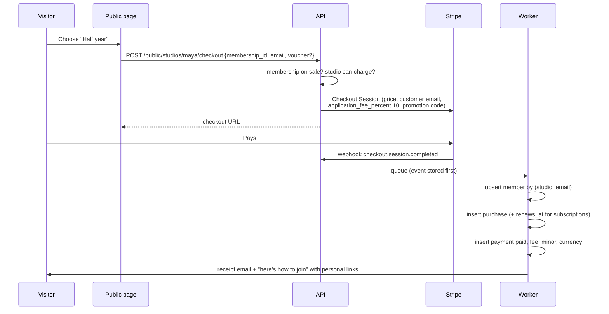
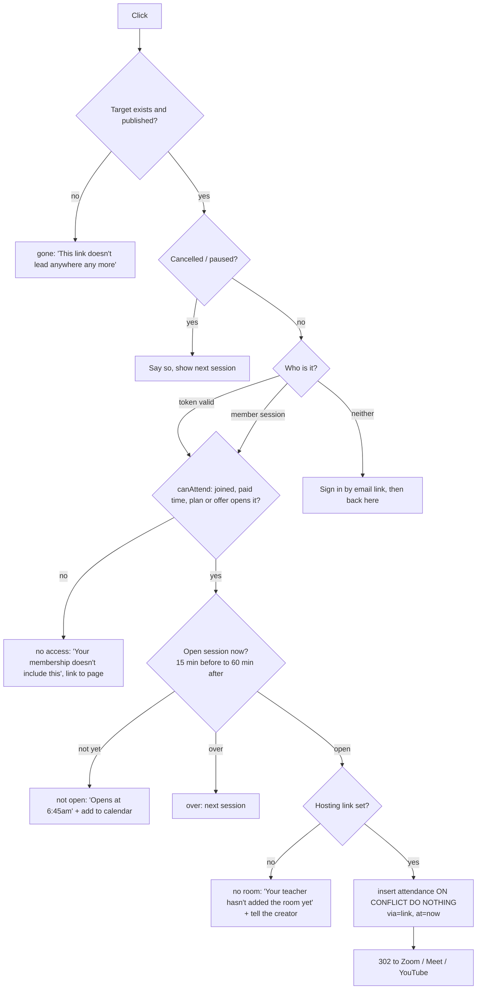

# Flows

How the important things happen, end to end. Each names the rule it runs and
the decision it keeps.

- [Sign-up and claiming a handle](#sign-up-and-claiming-a-handle)
- [Getting paid: connecting Stripe](#getting-paid-connecting-stripe)
- [Publishing a programme](#publishing-a-programme)
- [Publishing and restoring My page](#publishing-and-restoring-my-page)
- [Buying a plan or programme](#buying-a-plan-or-programme)
- [Renewals, failed payments and "Payment due"](#renewals-failed-payments-and-payment-due)
- [Stop renewal, gift days, vouchers](#stop-renewal-gift-days-vouchers)
- [Payouts](#payouts)
- [The join link](#the-join-link)
- [Marking attendance](#marking-attendance)
- [Recorded programmes](#recorded-programmes)
- [Moving or cancelling a class](#moving-or-cancelling-a-class)
- [Changing settings](#changing-settings)
- [Deleting things](#deleting-things)
- [Background jobs](#background-jobs)

---

## Sign-up and claiming a handle

1. `POST /auth/signup` — create the user unverified, email a 6-digit code
   (hashed, 10 minutes, 5 tries). *Or* Google: verified on arrival.
2. `POST /auth/verify` — mark verified, start a session.
3. As the creator types a handle, `GET /handles/:h/availability` runs
   `handleProblem` against `studios.handle` and the reserved words list. Debounced in the dashboard; rate-limited on the server.
4. `POST /studios` — in one transaction: insert the studio (the unique index is
   the real availability check — two people racing for `maya` get one success
   and one "klubyou.co/maya is taken") with its owner and an empty page draft,
   default currency from the browser's locale and **zone from the browser**
   (`deviceTimezone`), shown and changeable on Settings.

## Getting paid: connecting Stripe

Nothing can be sold until the studio has a Stripe Connect account.

1. `POST /studio/stripe/onboarding-link` creates an Express account (country and
   currency from Settings) and returns Stripe's hosted onboarding link.
2. Whether the account can take charges is asked of Stripe and cached for a few
   minutes (`account.updated` clears the cache) — not copied into a column.
3. The account's payout schedule is set to **weekly, anchored on Friday**, which
   is what `PAYOUT_WEEKDAY` promises.
4. Until charges are enabled, publishing still works (a creator can prepare),
   but checkout on the public page says "Not taking payments yet", and the
   Overview's attention list gains "Connect Stripe to start selling".

## Publishing a programme

`POST /studio/programmes/:id/publish`:

1. Load the programme with its memberships (offers), sections and classes (live or video kind).
2. Run `readiness(programme)`. If a required item is unmet, `422` with
   `blocker` and the item's own sentence. Joining links are **optional** for a
   live programme (decision "Joining links never block publishing"); a recorded
   video with no video **blocks**.
3. Pricing must be decided: at least one offer or `studio_only = true`
   ("How it's sold must be decided").
4. Create a Stripe Product and a Price per programme membership
   (`interval_months` null → one-time price, a number → recurring every that many
   months) on the connected account, in the studio's currency. Store the price ids.
5. Set `status = published`, `published_at`, write the audit log, purge the
   public page cache.

Unpublishing flips status back: it leaves the page and checkout, **existing
buyers keep access**, and prices are archived in Stripe so no new sale happens.

The same pattern — the rule refuses on the server with the sentence the
dashboard already shows — applies to plans (`planIsHollow` warns but doesn't
block, as today), bundles and benefits.

## Publishing and restoring My page

- **Edit**: every change writes `studios.page_draft`. Visitors don't see it.
- **Publish** (`POST /studio/page/publish`): if the draft differs from the latest
  version (`pageChanged`), insert `page_versions` with the next `number`, the
  draft as `content`, and who published it; purge the public page cache.
  Otherwise nothing happens and the response says so.
- **History** (`GET /studio/page/versions`): every version, newest first. The
  dashboard can preview any of them with the existing `PagePreview`, since a
  version is the same shape as the draft.
- **Restore** (`POST /studio/page/versions/4/restore`): set the draft to version
  4's content — the "Publish changes" button then appears as it does for any
  edit. With `{ publish: true }` it also publishes, as a new version with
  `restored_from = 4`. Later versions are never removed, so a restore can be
  undone by restoring the version before it.
- Images an old version uses are kept by the cleanup job, so a restored page
  has its pictures.

## Buying a plan or programme

- **Member upsert**: an existing lead (signed up, not bought) becomes a buyer —
  same member, new purchase. A member can hold several purchases.
- **Access starts when the payment does**, never on redirect back from Stripe
  (a closed tab must not lose a sale, a forged return URL must not grant one).
- **One path for both types.** A studio plan and a programme offer are both a
  `membership`; checkout, the purchase and the payment don't branch on which.
- **Lifetime**: `interval_months` null → purchase with `renews_at = null`.
- **Renewing** (every studio membership, programme subscriptions): the purchase
  carries the Stripe subscription id and `renews_at` from it.
- **Fee**: `application_fee_percent = 10` on subscriptions,
  `application_fee_amount` on one-off payments. `fee_minor` is written from what
  Stripe actually took.
- Buying a programme that's also inside the member's plan is allowed; the
  checkout page says "It's already in your Half year plan" first
  (`grantReason`).

## Renewals, failed payments and "Payment due"

Stripe runs the renewal; the backend records it. A payment row is only written
once an invoice is paid or has failed — a `pending` row is what makes a member
*Payment due* (`stateOf`), so an invoice that's merely been drafted mustn't create one.

| Stripe event | Backend does | Dashboard shows |
| ------------ | ------------ | --------------- |
| `invoice.paid` | Insert (or update) the payment as `paid`; purchase `renews_at` = the subscription's new period end | Renews on the new date |
| `invoice.payment_failed` | Insert (or keep) the payment as `pending`, attempt count noted; email the member (Stripe retries on its schedule) | *Payment due*, attention item "payments haven't gone through" |
| `customer.subscription.updated` | Mirror `cancel_at_period_end`, period end | *Ending* / *Renews soon* |
| `customer.subscription.deleted` | Grant `ended_at` | *Inactive* |

**"Mark as paid" changes meaning.** In the prototype the creator marks a
pending payment paid and the renewal moves on (`markPaymentPaid`,
`renewalAfterPayment`). With Stripe, card renewals settle themselves. Manual
marking remains for **money taken outside Stripe** (cash, bank transfer):
`method = manual`, the purchase's `renews_at` moves on by the membership's
`interval_months` (`renewalAfterPayment`), and the Stripe subscription — if any —
is moved to match by setting `trial_end` to the new period end, so the member
isn't charged twice. Marking a Stripe invoice paid is refused with "This is
being collected by card — Stripe will retry it", unless the creator chooses
"They paid another way", which voids the Stripe invoice first.

## Stop renewal, gift days, vouchers

- **Stop renewal** (`setMemberAutoRenew(false)`): Stripe
  `cancel_at_period_end = true`; access runs to the end (`canStop`). **Resume**
  before then sets it back (`canResume`). Only for renewing purchases; lifetime
  can't be stopped.
- **Gift days** (7 / 14 / 30, `canGift`): move `renews_at` by the days
  and set the Stripe subscription's `trial_end` to the new date with no
  proration — the next charge moves, nothing is refunded. The audit log records the gift.
- **Vouchers**: create a Stripe Coupon (`percent_off`, once) and a Promotion
  Code with the studio-unique code (`voucherCode`, e.g. `EMMA20`), restricted to
  that customer. Store it. The dashboard's email button still opens the
  creator's mail app with the code (kept — see open questions). Redemption at
  checkout is Stripe's to record.

## Payouts

Stripe pays the connected account every Friday. The backend:

- stores nothing about payouts — the list is read from Stripe when the
  Payments page asks;
- still computes the dashboard's "Next payout" with `nextPayoutDay` in the
  studio's zone and "what was paid since the last one, after the fee"; a nightly
  job compares that figure with Stripe's pending balance and logs any difference
  over 1 minor unit for investigation (it should only differ by refunds and
  disputes, which are then shown);
- a failed payout becomes an attention item: "Your payout didn't go through —
  check your bank details in Stripe".

Payout arrival is set by Stripe per country. The UI keeps "Paid out every
Friday", which is the schedule, not a promise about the bank.

## The join link

`GET join.klubyou.co/maya/<classId>?m=<token>` for an everyday lesson or one-off
(one link for every session), `/maya/<programmeId>/<classId>` for a programme
class. All three are rows in `classes`; the path shape stays as the dashboard
already hands it out (`joinLinkOf`).

- **Which session**: for a lesson, the occurrence whose window contains now, in
  the studio's zone (`openSessionOf`); its key uses the studio-local date.
- **Every click** is logged with its outcome (structured logs, not a table), so
  "I couldn't get in" is answerable by support.
- **Idempotent**: going through twice keeps the first time (`withJoin`); the
  unique `(class_id, session_date, member_id)` is the guarantee.
- **The hosting link is never in the HTML** of any member-facing page — only in
  the redirect's `Location`, after the checks. This is what makes attendance
  meaningful.
- **Tokens**: 128-bit, hashed in `members.link_token_hash`, one per member (not
  per session); "Reset their links" replaces it if a link is forwarded.
- **Speed**: this is the hot path at 6:59am. It runs in the API process with
  the session lookup and access check on indexed columns and a 30 s cache of
  the studio's lessons/classes; target p95 < 150 ms.
- **"No room"** also queues a push to the creator: "3 people are waiting for
  Sunrise Flow — add the Meet link".

**Watch time — later.** A Zoom integration could match `participant_joined` /
`participant_left` to attendance by email (only when members are signed in to
Zoom). It needs its own table when built; until then the session page keeps
saying a link can't see how long anyone stayed.

## Marking attendance

`PUT /studio/attendance/:sessionKey/members/:memberId {present}`:

- refused before the session starts ("You can mark attendance once it starts");
- present → insert `via = marked`, `at = session start`, and an audit log entry
  naming who marked it; a link record already there is kept;
- absent → delete the record, **including a link record**, and write the audit
  log with what was removed;
- someone marked who has no access is allowed and shown, and doesn't count
  towards turn-up (`sessionReport`).

## Recorded programmes

1. The creator adds a video: the API creates a Mux direct upload and returns its
   URL; the browser uploads straight to Mux.
2. `video.asset.ready` → store the asset id and `duration_seconds` (the
   prototype's typed `duration: "9:40"` becomes a fact from Mux).
3. A buyer opens the player: `GET /me/classes/:id/playback` checks access (lifetime,
   subscription or a plan that opens the programme) and returns a signed
   playback token valid for a few hours.
4. The player reports progress every 15 s and on end; `completed_at` is set at
   90% watched. "Videos watched" counts those.

Pasted YouTube / Vimeo links stay allowed for intro videos (they're public by
design) but not for paid videos, which a buyer could share.

## Moving or cancelling a class

- **Move** (`updateClassTiming`, `scope = one|series`): one class takes the new
  instant; for a series, every class shifts by the same delta — the prototype's
  rule. There's no run window to validate against — the programme's dates move
  with the classes (`runWindow`).
- **Notify** (`notify: true`): the worker emails everyone who can attend
  (`canAttend`) the new time, **in the member's own zone if known, else the
  studio's**, with the unchanged join link.
- **Cancel**: `cancelled_at`; the join link says "cancelled"; members who can
  attend are emailed if notify is on. Cancelled classes don't count as held.

## Changing settings

`PATCH /studio/settings` (after `?dry_run=true` returned the `consequences`
the confirmation modal shows):

- **Name**: update `studios.name`; the public page reads it live (it isn't part
  of the page draft — decision 2026-09-16).
- **Handle**: update `studios.handle`, write the audit log, purge caches. Share links and members' links are derived, so
  nothing else needs rewriting. Old links 404 — or redirect, per the open
  question. The confirmation already says links already shared stop working.
- **Time zone**: update and nothing else. Everyday lessons keep their
  `local_time` (7:00 stays 7:00 in the new zone); classes keep their instant, so
  their shown times move — exactly the decision's wording. Already-recorded
  attendance keeps its `session_date`. Reminder jobs re-plan from the new zone.
- **Currency** — **cannot work the way the prototype does once anyone has
  paid.** The decision says a currency change relabels prices without
  converting. In Stripe, a price has a fixed currency and a live subscription
  can't change currency. So the backend allows a currency change only while
  **no active subscription and no payment exists**; after that it returns
  `409` "You've taken payments in GBP — contact us to change currency". This
  needs a product decision; see open questions.

## Deleting things

The prototype deletes freely because nothing is real. With buyers:

| Deleting | While | Backend |
| -------- | ----- | ------- |
| A programme | anyone holds access to it | Refused: "People have bought this — unpublish it instead" |
| A membership (plan or offer) | anyone bought it | Offer: archived, not deleted. Plan someone holds: refused; unpublish instead |
| A bundle / benefit (membership item) | always allowed | Removed from every plan in the same transaction (cascade kept from `deleteBundle`) |
| A class of any kind | always allowed | Deleted; attendance kept (it has no foreign key on purpose), members who could attend upcoming sessions emailed if notify |
| A page version | never | Versions are append-only — restore an older one instead |
| A member | — | Not offered to creators; a member asking to be forgotten is handled as a GDPR erasure (delivery.md) |

## Background jobs

| Job | When | Does |
| --- | ---- | ---- |
| `stripe.process-event` | on webhook | Applies the tables above, idempotently |
| `class.reminder` | 1 h and 10 min before each occurrence | Email / push "Sunrise Flow starts at 7:00am — join here" with the personal link, to members who can attend and opted in |
| `link.missing` | 24 h before an occurrence with no hosting link | Tells the creator (the attention item, delivered) |
| `renewal.upcoming` | 3 days before `renews_at` | Member email for plans renewing (card-network rules for longer terms) |
| `attendance.digest` | Monday 8am studio time | Creator email: last week's sessions, turn-up, quiet members (`quietMembers`) |
| `payout.reconcile` | nightly | Compare computed next payout with Stripe balance |
| `media.cleanup` | daily | Delete uploaded images no draft **or page version** refers to, after 24 h |
| `stripe.reconcile` | nightly | Compare purchases and payments with Stripe subscriptions and invoices; alert on drift |

Scheduling occurrence-based jobs: every 10 minutes a planner expands the next
two hours of occurrences for every studio (`occurrencesBetween` per studio, in
its zone) and enqueues reminders with a stable job id (`reminder:<class_id>:<date>:60`),
so re-planning after a class moves replaces the job instead of duplicating it.
